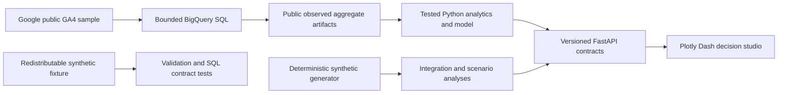

# Marketing Measurement Decision Studio

An end-to-end data science portfolio product that turns Google's public, obfuscated
GA4 ecommerce sample into governed funnel, cohort, attribution, and conversion-model
evidence, then demonstrates privacy-conscious integration and budget-planning patterns
with a visibly separate synthetic dataset.

No customer, Data Design Dynamics, healthcare-patient, or personal-account data is
used. Public observed evidence and synthetic demonstrations are never combined into
one claim.

## Two-minute reviewer path

1. Read the four verified findings below and their decisions.
2. Open the reviewed [desktop dashboard](.impeccable/review/desktop.png) or
   [mobile dashboard](.impeccable/review/mobile.png). The dashboard consumes only the
   versioned API; each chart includes a table alternative and provenance disclosure.
3. Inspect the [lineage](docs/lineage.md), [metric dictionary](docs/metric-dictionary.md),
   [conversion model card](docs/models/conversion-model-card.md), and
   [API contracts](docs/api/v1-contracts.md).
4. Reproduce the release with the commands under **Clean setup and verification**.

## Verified findings and decisions

All public observed findings concern only
`bigquery-public-data.ga4_obfuscated_sample_ecommerce.events_*` from **2020-11-01
through 2021-01-31**. The sample is old, obfuscated, ecommerce-specific, and not
representative of a current business or campaign.

### 1. Engagement was broad; cart entry was narrow

- **Evidence:** Public observed. **250,206 of 333,683** viewed sessions were engaged
  (74.98%). Of those engaged sessions, 14,919 reached cart (5.96%); 5,956 of those
  reached checkout (39.92%); 2,847 of those reached purchase (47.80%).
- **Decision:** Prioritize instrumentation and testable journey hypotheses around the
  engaged-to-cart transition before optimizing later checkout stages.
- **Limitations:** This is a descriptive session funnel, not causal evidence. A stage
  means the session contained that event; ordered event progression is not asserted.
- **Trace:** [`sql/bigquery/funnel_daily_by_channel.sql`](sql/bigquery/funnel_daily_by_channel.sql)
  → [`notebooks/01_public_data_findings.ipynb`](notebooks/01_public_data_findings.ipynb)
  → [`data/derived/ga4_public_sample/findings_summary.json`](data/derived/ga4_public_sample/findings_summary.json).

### 2. Day-seven return was uncommon in complete cohorts

- **Evidence:** Public observed. Across 85 true first-touch cohorts whose day seven was
  fully observable, **1,611 of 238,644** users returned on day seven (0.68%).
- **Decision:** Treat return behavior as a measurement question requiring explicit
  lifecycle hypotheses and current-data validation, not as an assumed growth lever.
- **Limitations:** First touch is measured within the public source window; obfuscation
  and the historic ecommerce context limit generalization.
- **Trace:** [`sql/bigquery/cohort_retention.sql`](sql/bigquery/cohort_retention.sql)
  → [`notebooks/01_public_data_findings.ipynb`](notebooks/01_public_data_findings.ipynb)
  → [`data/derived/ga4_public_sample/findings_summary.json`](data/derived/ga4_public_sample/findings_summary.json).

### 3. Attribution conclusions depend on the accounting rule

- **Evidence:** Public observed. For **3,230** eligible converted sessions dated
  2020-12-01 through 2021-01-31, each with a complete 30-day source-window lookback,
  Google / organic received 1,284 first-touch credits and 1,032 last-touch credits.
  The four attribution methods each reconcile to all 3,230 conversions.
- **Decision:** Use attribution comparisons to identify investigation priorities, then
  use randomized experiments for causal campaign decisions.
- **Limitations:** **descriptive attribution; not causal**. Event-scoped channel data
  include unattributed and obfuscated values.
- **Trace:** [`sql/bigquery/conversion_channel_paths.sql`](sql/bigquery/conversion_channel_paths.sql)
  → [`src/marketing_measurement/analysis/attribution.py`](src/marketing_measurement/analysis/attribution.py)
  → [`data/derived/ga4_public_sample/findings_summary.json`](data/derived/ga4_public_sample/findings_summary.json).

### 4. A leakage-safe model improved ranking, but remains educational

- **Evidence:** Public observed, identifier-free deterministic 10% user-level sample.
  The selected logistic model scored 0.041429 PR-AUC on 7,245 untouched held-out
  sessions versus a 0.013941 no-skill baseline. A training-only frozen threshold of
  0.035589 flagged 317 sessions (4.38% of the holdout) with 6.94% precision
  and 21.78% recall.
- **Decision:** The workflow supports capacity-aware review-queue design; any real use
  requires current governed data, a new validation set, privacy review, and monitoring.
- **Limitations:** Only 101 held-out conversions were observed; the split key is
  non-unique, the data are sampled and historic, and prediction does not establish lift.
- **Trace:** [`sql/bigquery/conversion_model_sessions.sql`](sql/bigquery/conversion_model_sessions.sql)
  → [`notebooks/02_conversion_model.ipynb`](notebooks/02_conversion_model.ipynb)
  → [`docs/models/conversion-model-card.md`](docs/models/conversion-model-card.md).

## Synthetic decision demonstrations

The integration-health, randomized-experiment, and constrained-budget features use
only deterministic synthetic records (`seed=20260910`). They demonstrate engineering
and decision mechanics—not observed campaign performance, live integrations, causal
lift, or forecasts. The 200-record experiment is intentionally underpowered (100 per
arm versus 2,033 planned per arm) and therefore declares no winner.

## Architecture



The runtime API is read-only over reviewed local artifacts. It does not query BigQuery
or require credentials. PostgreSQL-compatible analytical SQL is tested against local,
redistributable fixtures, with DuckDB as the default test engine.

## Clean setup and verification

Prerequisites: Git and Python 3.12. Until this repository is published, the exact
runnable source is the current local Git checkout. The commands below export its
committed `HEAD` into a new temporary directory, require no cloud credentials, and do
not contact BigQuery after dependency installation.

```bash
SOURCE_CHECKOUT='/Users/christinaperrone/Documents/Claude/Projects/Data Design Dynamics/portfolio-projects/marketing-measurement'
RELEASE_COPY="$(mktemp -d "${TMPDIR:-/tmp}/marketing-measurement-release.XXXXXX")"
git -C "$SOURCE_CHECKOUT" archive HEAD | tar -x -C "$RELEASE_COPY"
cd "$RELEASE_COPY"
python3.12 -m venv .venv
.venv/bin/python -m pip install --upgrade pip
.venv/bin/python -m pip install -e '.[dev]'
make release-gate
```

There is intentionally no public clone URL yet. Once the owner approves publication,
the release notes can replace the local export step with the immutable public repository
URL and tag; no URL is invented here.

`make release-gate` verifies reviewed SHA-256 values before any executable step, runs
Ruff, strict mypy over `src` and `api`, all pytest suites, and both notebooks offline
inside a temporary source copy after copied generated outputs are removed. Every output
must be freshly created and byte-identical to the reviewed artifact; checksums are
verified again afterward, and executed notebooks go to
`.artifacts/notebook-smoke/`. The source checkout is never repaired or rewritten.

To run the interfaces in two terminals:

```bash
make api        # http://127.0.0.1:8000/docs
make dashboard  # http://127.0.0.1:8050
```

Useful individual gates:

```bash
make lint
make typecheck
make test
make notebook-smoke
make verify-checksums
```

Live public-source retrieval is intentionally excluded from CI. The bounded retrieval
scripts require an explicitly supplied Google Cloud billing project and enforce a
4 GB maximum-bytes-billed cap per query; see
[`docs/sources/ga4-public-sample.md`](docs/sources/ga4-public-sample.md).

## Repository map

| Path | Purpose |
| --- | --- |
| `sql/` | BigQuery source queries plus cross-engine staging and marts |
| `src/marketing_measurement/` | Validation, analysis, modeling, simulation, and optimization |
| `api/` | Ten typed FastAPI v1 routes backed by reviewed artifacts |
| `dashboard/` | Accessible, responsive, API-only Plotly Dash decision interface |
| `notebooks/` | Executable public-finding and conversion-model narratives |
| `data/` | Separated public observed outputs, derived findings, manifests, and fixture |
| `tests/` | Data quality, SQL, analysis, model, API, dashboard, and release contracts |
| `docs/` | Sources, lineage, metrics, model governance, UAT, risks, and release evidence |

## Scope and non-claims

- No real customer, DDA, healthcare, or proprietary data or methods.
- No claim that the Google sample represents healthcare consumers or current markets.
- No live ad-platform integration claim.
- No causal claim from attribution, observational prediction, or synthetic scenarios.
- No production targeting recommendation; model use is educational decision support.

License and redistribution terms for Google's source remain governed by the upstream
dataset. This repository commits compact derived public outputs and an identifier-free
session sample, not raw event-level data or unique identifiers.
